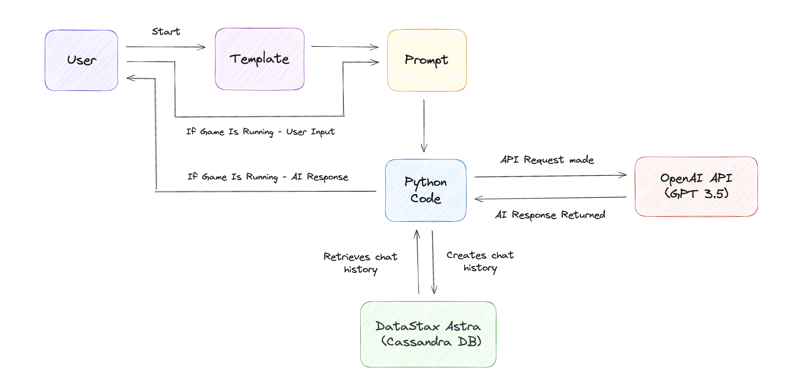

# Python-Based AI Space Simulator Game

Welcome to the Python-based AI Space Simulator Game! This interactive text-based adventure allows players to guide a space traveler named Nova on a quest to find the legendary Star Crystal. The game dynamically adapts to players' decisions, creating a branching narrative with various outcomes.

## Architectural Diagram 🏛️




## Prerequisites

Before getting started, ensure you have the following:

- Python 3.7 or higher
- OpenAI API Key
- DataStax Astra Database (Cassandra DB)

## Installation

### 1. Install dependencies

```bash
pip3 install cassandra-driver openai langchain
```

### 2. Replace variables

Replace the following variables in `tutorial.py` with your values:

- `OPENAI_API_KEY` with your OpenAI API Key.
- `ASTRA_DB_KEYSPACE` with your Astra DB Keyspace.
- `secure-connect-file.zip` with the zip file name you downloaded from Astra DB.
- `connect-token.json` with the JSON file name you downloaded from Astra DB.
   
### 3. Run the program

```bash
python3 tutorial.py
```
